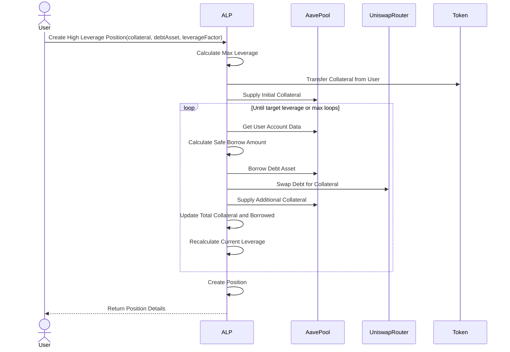

# ✨ Aave Leveraged Positions ✨

This repository contains the smart contracts for creating and managing Leveraged Positions on Aave V3 pools (ALP). The ALP contracts enable users to create and manage high-leverage positions using multiple collaterals.


## What is ALP?

Automated Leverage Positions (ALP) is a smart contract based system that simplifies and automates the creation and management of leveraged/multi-collateral positions. By using multiple collateral types and looping mechanisms, ALP allows users to maximize the exposure and efficiently manage their leveraged positions.

#### Inspired by CDPs

The concept of ALP is inspired by MakerDAO's Collateralized Debt Positions (CDPs), which are used in DeFi to lock up collateral and generate DAI. ALP extends this idea by representing leveraged positions opening up possibilities for these positions to be tokenized and traded on secondary markets.

## Getting started:

- Clone this repo.
- `cd` into `aave-leveraged-positions` 
- Run `forge test` to run fork tests
- Scripts are added for deploying factory contract and creating new ALPs via factory.

## Key Features and Benefits

1. **Multi-Collateral Positions**
   - Create leveraged positions using multiple types of collateral assets.
   - Allows for risk diversification and optimized leverage strategies.
   - Automatically calculates safe leverage based on the lowest LTV among collaterals.
   - Enables users to tailor positions to match their goals, leading to more customized strategies.

2. **High Leverage "Degen Mode" Positions**
   - Create single-collateral positions with higher leverage.
   - Utilizes automated looping to maximize exposure in a single transaction.
   - Implements safety checks to prevent unsafe positions.
   - Simplifies the complex process of creating leveraged positions removing manual looping, making it more accessible and cost-effective.

3. **Position Management**
   - *Add collateral*: Increase position size or reduce risk by adding more assets.
   - *Repay debt*: Partially or fully repay borrowed amounts to adjust leverage.
   - *Close positions:* Automatically repays debt, withdraws collateral, and settles the position.
   - Isolated position management enhances risk control and enables diverse trading strategies.

4. **Simplified Leverage Creation**
   - Automates the process of creating leveraged positions in a single transaction using `ALPFactory`.
   - Reduces complexity and costs associated with manual leveraging.
   - Makes it easier for users to maximize their exposure and implement custom strategies.

5. **Isolated Positions**
   - Each position is managed independently within isolated smart contracts.
   - Isolates risk, ensuring the performance or liquidation of one position doesn't affect others.
   - Enhances composability, potentially allowing positions to be used as collateral in other DeFi protocols.
   - Facilitates easier position tracking, performance analysis, and integration with portfolio management tools.

> [!WARNING]
> High leverage is always a risk. The ALP contract only helps create and manage positions.
> Constant monitoring is required to avoid liquidations!

## How leveraging works?

1.  **Deposit Collateral:** The user deposits an initial amount of collateral (e.g., ETH).

2.  **Borrow and Swap:** The contract borrows a percentage of the deposited collateral (based on the LTV), swaps it for more collateral, and redeposits it.

3.  **Repeat:** This process is repeated automatically to achieve the desired leverage.
  

The total collateral value \(C\) after infinite loops is given by: 

$$C = c \cdot \frac{1}{1 - v}$$

Where:
- $c$ is the initial collateral.
- $v$ is the loan-to-value (LTV) ratio.

The maximum leverage $L$ is:

$$ L = \frac{1}{1 - v} $$

This formula allows us to calculate the theoretical maximum collateral value achievable through repeated borrowing and reinvesting.

*([Thanks to Bentley for his recent research paper on this topic](https://github.com/euler-mab/looping-and-leverage/blob/main/Looping_and_Leverage_in_Decentralised_Finance__DeFi_.pdf))[^1]*

#### Example

Consider a user who wants to leverage their ETH using DAI as the debt asset, with an LTV of 75%. Here's how the process would work:

```
L = 1 / (1 - v)
  = 1 / (1 - 0.75)
  = 1 / 0.25
  = 4
```

This means a user can achieve a maximum leverage of `4x` with ETH as collateral.

In practice, this allows a user to amplify their position significantly:

1. User deposits 1 ETH worth $2000
2. Maximum borrowing capacity: 0.75 * $2000 = $1500
3. Total position value: $2000 (initial) + $1500 (borrowed) = $3500
4. Effective leverage: $3500 / $2000 = 1.75x

Through looping (re-depositing borrowed assets), the user can approach the maximum 4x leverage.

We use this formula in `calculateMaxSafeLeverage()` method to calculate the maximum safe leverage for a given set of collateral assets. Also, we use this in our position creation logic to ensure we don't exceed safe leverage levels:

```solidity
uint256 maxSafeLeverage = calculateMaxSafeLeverage(collateralAssets);
if (_leverageFactor > maxSafeLeverage) revert LeverageExceedsMaxSafe();
```

By this check, we can make sure that users can't create positions that exceed the maximum safe leverage determined by the pool parameters, ensuring safe positions.


## Flow diagram

### High Leverage Position Creation



  

## Future Improvements

- Active Position Monitoring via Chainlink Upkeep (top-up collateral when required).
- DEX Aggregator for Swaps.
- Cross-Chain Position Management via CCIP.
- Flashloan Support.
- More Tests and Gas Optimizations.

## Disclaimer:
*This code is provided for educational and informational purposes only.Use at your own risk. The authors are not responsible for any losses or damages resulting from its use.*

[^1]: Michael A Bentley (2024). Looping and Leverage in Decentralised Finance (DeFi).
